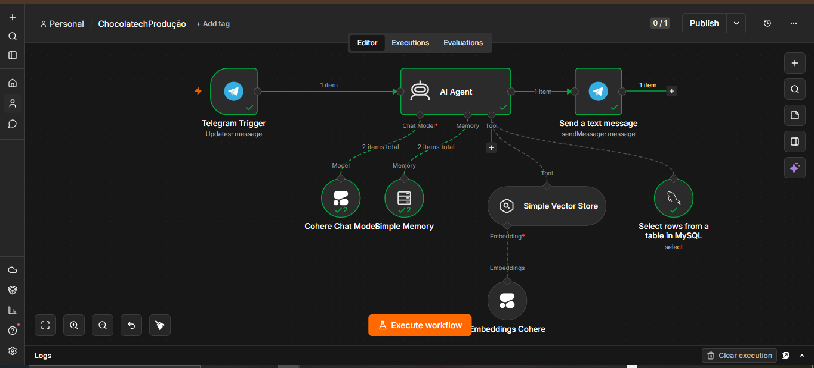

# ONE | Imersão Agentes de IA

Projeto de construção de um **Agente de IA** (HR Buddy) usando ferramentas no-code/low-code, capaz de responder dúvidas de RH combinando uma base de conhecimento (RAG) com dados reais de funcionários em um banco MySQL, com interface via Telegram.

📄 **[Acesse a documentação completa do projeto](documentation.md)** — passo a passo detalhado de toda a Masterclass e das Aulas 1 a 3.

## 📌 Sobre o projeto

O objetivo é sair do uso de prompts simples e construir um agente que **raciocina, planeja e executa tarefas**, em vez de apenas responder. O HR Buddy é o resultado final: um assistente virtual de RH que:

- Identifica o funcionário pelo nome
- Consulta saldo de férias e banco de horas reais no MySQL
- Responde dúvidas gerais de RH com base em documentos (RAG)
- Conversa pelo Telegram, com memória por usuário

## 🛠️ Stack utilizada

| Ferramenta   | Função no projeto                                 |
| ------------ | ------------------------------------------------- |
| **Cohere**   | Modelo de linguagem (LLM) e geração de embeddings |
| **Railway**  | Hospedagem em nuvem (banco de dados MySQL)        |
| **n8n**      | Orquestração visual do fluxo do agente (low-code) |
| **MySQL**    | Banco de dados estruturado de funcionários        |
| **Telegram** | Interface de chat com o usuário final             |

## 🗂️ Estrutura do conteúdo

1. **Masterclass — Introdução à IA Agêntica**
   Preparação do ambiente: criação de contas na Cohere e Railway, criação do bot no Telegram.

2. **Aula 1 — O Cérebro do Agente (RAG, embeddings e n8n)**
   Ingestão de documentos, geração de embeddings e configuração do agente para responder com base em uma base de conhecimento real.

3. **Aula 2 — Memória e Dados (integração com MySQL)**
   Criação da tabela `funcionarios`, conexão do n8n ao banco e configuração do agente para consultar dados reais via `$fromAI`.

4. **Aula 3 — Produto Real (Telegram e Automatização)**
   Conexão do agente ao Telegram via Webhook, implementação de guardrails e memória por usuário (session ID).

   

## ⚙️ Pré-requisitos

- Conta na [Cohere](https://cohere.com) com API Key gerada
- Conta na [Railway](https://railway.com)
- Bot criado no Telegram via [@BotFather](https://t.me/BotFather), com token salvo
- Conta no [n8n](https://n8n.io) _(criar apenas no momento indicado na aula)_

## 🗄️ Banco de dados

### Criação da tabela

```sql
CREATE TABLE funcionarios (
    id INT AUTO_INCREMENT PRIMARY KEY,
    nome VARCHAR(100) NOT NULL,
    email VARCHAR(150) NOT NULL UNIQUE,
    departamento VARCHAR(100) NOT NULL,
    cargo VARCHAR(100) NOT NULL,
    data_admissao DATE NOT NULL,
    saldo_ferias INT NOT NULL DEFAULT 0,
    banco_horas DECIMAL(5,1) NOT NULL DEFAULT 0,
    regime VARCHAR(20) NOT NULL DEFAULT 'hibrido'
);
```

### Dados de exemplo

```sql
INSERT INTO funcionarios (nome, email, departamento, cargo, data_admissao, saldo_ferias, banco_horas, regime) VALUES
('João Silva', 'joao.silva@empresa.com', 'Engenharia', 'Engenheiro de Software', '2022-03-10', 20, 0.0, 'hibrido'),
('Maria Souza', 'maria.souza@empresa.com', 'Recursos Humanos', 'Analista de RH', '2021-05-15', 5, 12.5, 'hibrido'),
('Carlos Oliveira', 'carlos.oliveira@empresa.com', 'Financeiro', 'Analista Financeiro', '2023-01-20', 0, 0.0, 'presencial'),
('Ana Lima', 'ana.lima@empresa.com', 'Marketing', 'Especialista em Marketing', '2020-11-05', 15, -4.0, 'remoto'),
('Pedro Santos', 'pedro.santos@empresa.com', 'Vendas', 'Executivo de Vendas', '2022-08-01', 10, 8.0, 'hibrido'),
('Fernanda Costa', 'fernanda.costa@empresa.com', 'Operações', 'Gerente de Operações', '2019-02-12', 30, 0.0, 'presencial'),
('Rafael Mendes', 'rafael.mendes@empresa.com', 'TI', 'Analista de Suporte', '2023-06-10', 0, 15.5, 'hibrido'),
('Juliana Rocha', 'juliana.rocha@empresa.com', 'Engenharia', 'Desenvolvedora Front-end', '2021-09-25', 12, 0.0, 'remoto'),
('Bruno Alves', 'bruno.alves@empresa.com', 'Design', 'Designer UX/UI', '2022-04-18', 8, 3.5, 'hibrido'),
('Camila Ferreira', 'camila.ferreira@empresa.com', 'Atendimento', 'Analista de Atendimento', '2024-01-05', 0, 0.0, 'hibrido'),
('Eric Monné', 'eric.monne@chocolatech.com', 'Produto', 'Instrutor de Cursos', '2024-01-15', 25, 8.0, 'hibrido');
```

## 🤖 System Prompt do agente (HR Buddy)

```
Você é o HR Buddy, assistente virtual de RH da ChocolaTech.

REGRAS:
- Sempre responda em português.
- Responda APENAS dúvidas relacionadas a RH.

IDENTIFICAÇÃO DO FUNCIONÁRIO:
- Se o usuário não disser quem é, pergunte o nome completo dele
  logo na primeira mensagem.
- Use a ferramenta MySQL para buscar na tabela funcionarios
  usando SEMPRE o NOME COMPLETO informado pelo usuário na conversa.
- Se encontrado: use os saldos de férias e banco de horas.
- Se não encontrado: não invente dados pessoais. Responda apenas
  com base nas políticas gerais de RH do Vector Store.
- Use a base de conhecimento para dúvidas gerais.
```

## 🚀 Como executar (visão geral)

1. Crie as contas necessárias (Cohere, Railway, Telegram bot).
2. No n8n, monte o **fluxo de ingestão** dos documentos de RH (Load Data Flow) e gere os embeddings com a Cohere, salvando em um Vector Store.
3. Crie o **workflow do agente**, conectando o modelo da Cohere, o Vector Store (RAG) e a ferramenta MySQL.
4. Suba o banco MySQL na Railway e crie a tabela `funcionarios` com os dados acima.
5. Configure o System Prompt do agente conforme listado acima.
6. Conecte o workflow ao **Telegram** via Webhook, usando o token do bot.
7. Ative (publique) o workflow e teste a conversa de ponta a ponta.

## 🔄 Fluxo resumido

```
Usuário (Telegram)
      │
      ▼
  Webhook (n8n)
      │
      ▼
   AI Agent (Cohere) ──► Vector Store (RAG / documentos de RH)
      │
      └──► MySQL Tool (tabela funcionarios)
      │
      ▼
Resposta enviada de volta ao Telegram
```

## ✅ Checklist do projeto

- [ ] Conta Cohere criada (API Key salva)
- [ ] Conta Railway criada
- [ ] Bot do Telegram criado (token salvo)
- [ ] Fluxo de ingestão de documentos (RAG) funcionando
- [ ] Banco MySQL criado e populado
- [ ] Agente conectado ao MySQL via `$fromAI`
- [ ] System Prompt configurado
- [ ] Agente conectado ao Telegram via Webhook
- [ ] Memória por usuário (session ID) configurada
- [ ] Workflow publicado e testado ponta a ponta

## 📎 Créditos

Conteúdo baseado na Masterclass e Aulas 1–3 da **ONE & Alura| Imersão Agentes de IA**.

Documentado por **Tatiane Souza**.
