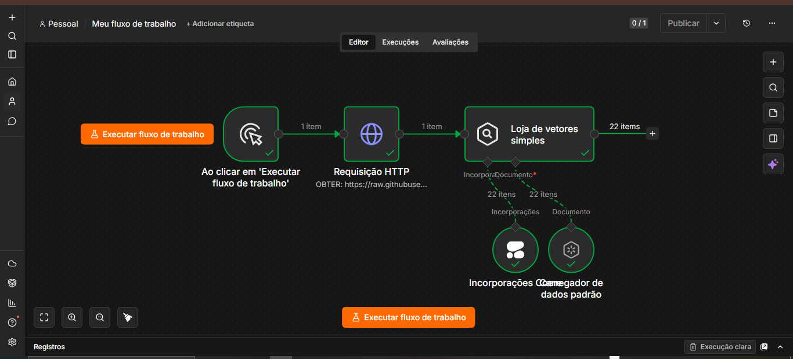
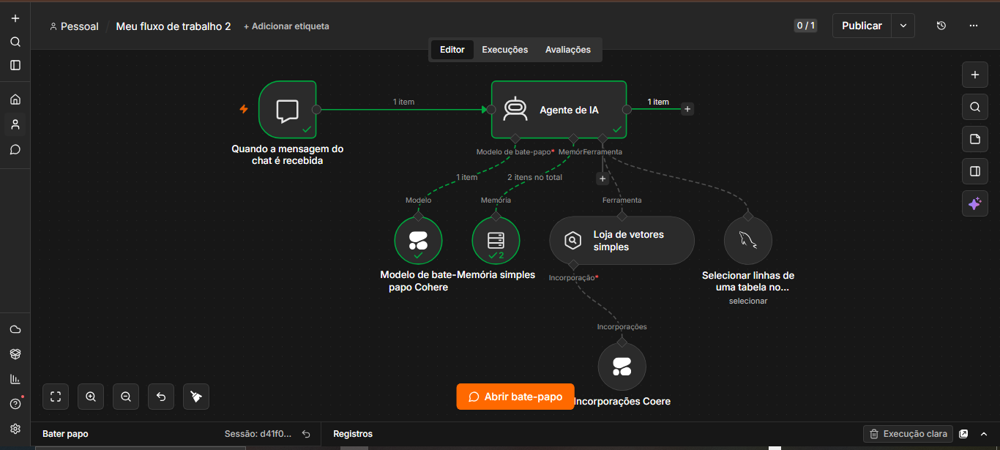
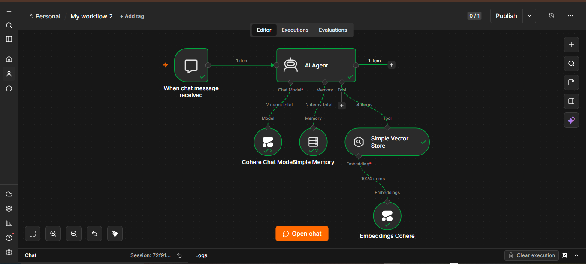
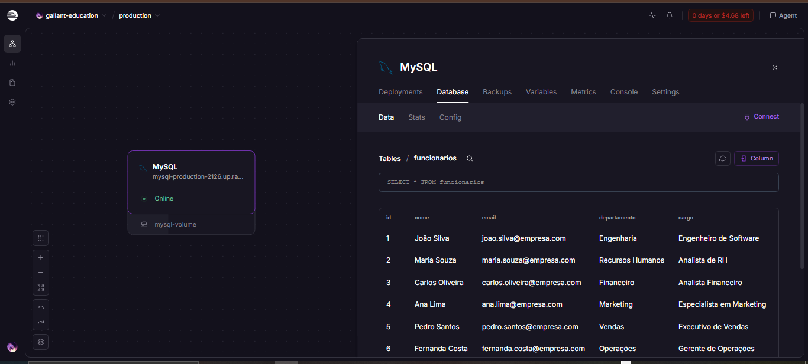
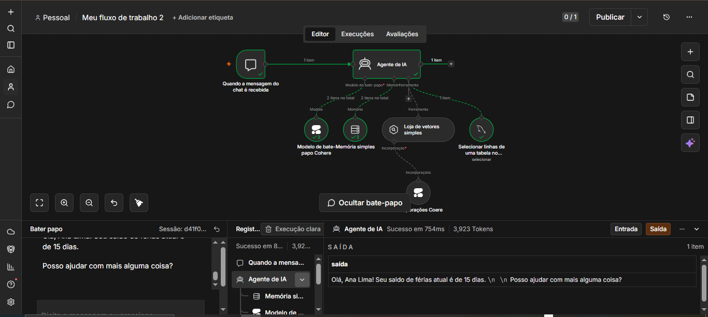
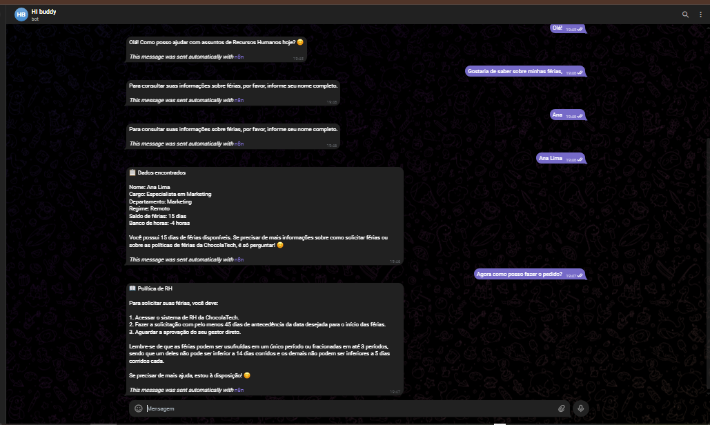

# ONE | Imersão Agentes de IA
## Documentação Completa do Projeto

**Construindo um Agente de IA com n8n, Cohere, MySQL e Telegram — passo a passo**

Preparado por: Tatiane Souza 

---

## Sumário

1. [Visão Geral do Projeto](#visão-geral-do-projeto)
2. [Masterclass — Introdução à IA Agêntica](#masterclass--introdução-à-ia-agêntica)
3. [Aula 1 — O Cérebro do Agente: RAG, Embeddings e n8n](#aula-1--o-cérebro-do-agente-rag-embeddings-e-n8n)
4. [Aula 2 — Memória e Dados: Integração da IA com MySQL](#aula-2--memória-e-dados-integração-da-ia-com-mysql)
5. [Aula 3 — Produto Real: Agente com Telegram e Automatização](#aula-3--produto-real-agente-com-telegram-e-automatização)
6. [Troubleshooting e Boas Práticas](#troubleshooting-e-boas-práticas)

---

## Visão Geral do Projeto

Esta documentação reúne, de forma organizada e passo a passo, todo o conteúdo da Masterclass e das três aulas da Imersão em Agentes de IA. O objetivo final é construir um Agente de IA funcional — com memória, base de conhecimento (RAG), integração com banco de dados (MySQL) e interface de conversa via Telegram — usando a ferramenta visual n8n, sem necessidade de programar.

O agente final, chamado **HR Buddy**, é um assistente virtual de RH capaz de responder dúvidas gerais (via base de conhecimento) e consultar dados reais de funcionários (saldo de férias, banco de horas) em um banco de dados MySQL.

> **Ferramentas utilizadas no projeto**
> Cohere (modelo de linguagem / embeddings) · Railway (hospedagem em nuvem) · Telegram (interface de chat) · n8n (orquestração do fluxo do agente) · MySQL (banco de dados estruturado).

### Estrutura do Projeto

- **Masterclass** — Introdução à IA Agêntica: preparação do ambiente e contas
- **Aula 1** — O Cérebro do Agente: RAG, embeddings e n8n
- **Aula 2** — Memória e Dados: integração da IA com MySQL
- **Aula 3** — Produto Real: agente no Telegram e automação completa

---

## Masterclass — Introdução à IA Agêntica

Objetivo: sair do uso de prompts simples e entender o que diferencia um Agente de IA — capaz de raciocinar, planejar e executar tarefas — de uma IA comum, que apenas responde. Esta etapa prepara as contas e ferramentas que serão a base de todo o projeto.

### O que você vai aprender nesta etapa

- A diferença entre uma IA comum (responde) e um Agente de IA (raciocina, planeja e executa)
- Como configurar o "cérebro" (modelo de linguagem) e a memória do agente
- Como criar uma interface de comunicação via bot do Telegram
- Como preparar o ambiente para o n8n (sem criar a conta ainda)

### Passo a passo de configuração

#### Etapa 1: Criar conta na Cohere

A Cohere fornece o modelo de linguagem (o "cérebro") que dará capacidade de raciocínio ao agente, além dos embeddings usados na etapa de RAG.

1. Acesse o site da Cohere (cohere.com).
2. Crie uma conta gratuita com seu e-mail.
3. No painel (dashboard), gere uma API Key — ela será usada futuramente para conectar o n8n ao modelo.
4. Guarde essa chave em local seguro; ela não deve ser compartilhada publicamente.

#### Etapa 2: Criar conta na Railway

A Railway é a nuvem que vai hospedar os serviços do projeto (por exemplo, o banco de dados MySQL e/ou a instância do n8n, dependendo de como o fluxo for hospedado).

1. Acesse railway.com.
2. Crie sua conta (pode ser via GitHub).
3. Familiarize-se com o painel de projetos — ele será usado nas próximas aulas para subir o banco de dados.

#### Etapa 3: Criar um bot no Telegram

O Telegram será a interface de conversa entre o usuário final e o agente.

1. Abra o Telegram e procure pelo contato `@BotFather`.
2. Envie o comando `/newbot`.
3. Escolha um nome e um username para o bot (o username deve terminar em "bot").
4. O BotFather vai gerar um token de acesso — guarde-o, pois será necessário para conectar o bot ao n8n na Aula 3.

#### Etapa 4: Preparar o ambiente para o n8n

> ⚠️ **Atenção**
> Não crie a conta no n8n ainda. A criação da conta será orientada no momento exato da aula, para garantir que a configuração inicial seja feita corretamente junto com a turma.

### Checklist de conclusão da Masterclass

- [ ] Conta criada na Cohere, com API Key salva
- [ ] Conta criada na Railway
- [ ] Bot criado no Telegram, com token salvo
- [ ] Conta do n8n ainda NÃO criada (aguardando instrução)

---

## Aula 1 — O Cérebro do Agente: RAG, Embeddings e n8n

Nesta aula o foco é dar "conhecimento real" ao agente, ensinando-o a responder com base em documentos próprios em vez de depender apenas do conhecimento genérico do modelo de linguagem.

### Conceitos-chave

#### O que é RAG (Retrieval-Augmented Generation)

RAG é uma técnica que combina busca de informação (Retrieval) com geração de texto (Generation). Em vez de a IA responder só com o que aprendeu em seu treinamento, ela primeiro busca trechos relevantes em uma base de documentos e depois gera a resposta usando esse contexto real como apoio. Isso reduz alucinações e permite que o agente responda sobre dados específicos da empresa.

#### O que são embeddings

Embeddings são representações numéricas (vetores) de um texto, que capturam seu significado semântico. Ao transformar documentos em embeddings, é possível comparar matematicamente o quão "parecido" um texto é de outro — é assim que o sistema encontra os trechos mais relevantes para responder a uma pergunta.

### Passo a passo prático

#### Etapa 1: Criar o fluxo de ingestão de dados (Load Data Flow)

1. No n8n, crie um novo workflow dedicado à ingestão de documentos.
2. Adicione um nó de leitura/upload do(s) documento(s) que servirão de base de conhecimento (políticas de RH, manuais, FAQs, etc.).
3. Adicione um nó de divisão de texto (text splitter) para quebrar o documento em pedaços menores (chunks), facilitando a busca posteriormente.
4. Conecte um nó de embeddings da Cohere para transformar cada chunk em vetor.
5. Envie os vetores gerados para um Vector Store (banco de dados vetorial) configurado no n8n.

#### Etapa 2: Estruturar o agente no n8n

1. Crie um novo workflow para o agente em si (separado do fluxo de ingestão).
2. Adicione o nó de "AI Agent" (ou equivalente) do n8n.
3. Configure o modelo de linguagem da Cohere como "cérebro" do agente.
4. Conecte o Vector Store criado na etapa anterior como ferramenta de consulta (RAG) do agente.
5. Defina um prompt inicial simples para testar se o agente consegue responder com base nos documentos carregados.

#### Etapa 3: Testar o fluxo de RAG

1. Execute o workflow manualmente no n8n.
2. Envie uma pergunta relacionada ao conteúdo dos documentos carregados.
3. Verifique se a resposta do agente reflete o conteúdo real da base de conhecimento, e não apenas conhecimento genérico.





> 💡 **Dica**
> Sempre teste o fluxo de ingestão isoladamente antes de conectar o agente — assim fica mais fácil identificar se um erro está na leitura do documento, na geração dos embeddings ou na consulta do agente.

---

## Aula 2 — Memória e Dados: Integração da IA com MySQL

Nesta aula o agente passa a acessar dados estruturados e específicos de cada usuário (como saldo de férias e banco de horas), combinando o conhecimento geral do RAG com dados reais vindos de um banco de dados relacional.

### Conceitos-chave

#### Dados estruturados (SQL) vs. não estruturados (RAG)

Dados não estruturados (textos, PDFs, manuais) são consultados via RAG/embeddings. Dados estruturados (registros organizados em tabelas, com colunas e tipos definidos, como uma tabela de funcionários) são mais bem consultados diretamente via SQL, com queries precisas. Um agente robusto sabe quando usar cada abordagem.

#### O parâmetro `$fromAI`

No n8n, `$fromAI` é um recurso que permite que a própria IA decida, dinamicamente, qual valor passar como parâmetro para uma ferramenta (por exemplo, qual nome buscar na query SQL), em vez de esse valor ser fixo no fluxo.



### Passo a passo prático

#### Etapa 1: Criar o banco de dados MySQL na Railway

1. Acesse seu projeto na Railway.
2. Adicione um novo serviço do tipo MySQL.
3. Aguarde a criação da instância e copie as credenciais de conexão (host, porta, usuário, senha e nome do banco).

#### Etapa 2: Criar a tabela de funcionários

Execute a query SQL abaixo em um cliente MySQL (ou diretamente no console da Railway) para criar a estrutura da tabela:

```sql
CREATE TABLE funcionarios (
    id INT AUTO_INCREMENT PRIMARY KEY,
    nome VARCHAR(100) NOT NULL,
    email VARCHAR(150) NOT NULL UNIQUE,
    departamento VARCHAR(100) NOT NULL,
    cargo VARCHAR(100) NOT NULL,
    data_admissao DATE NOT NULL,
    saldo_ferias INT NOT NULL DEFAULT 0,
    banco_horas DECIMAL(5,1) NOT NULL DEFAULT 0,
    regime VARCHAR(20) NOT NULL DEFAULT 'hibrido'
);
```

Em seguida, insira os dados iniciais de exemplo:

```sql
INSERT INTO funcionarios (nome, email, departamento, cargo, data_admissao, saldo_ferias, banco_horas, regime) VALUES
('João Silva', 'joao.silva@empresa.com', 'Engenharia', 'Engenheiro de Software', '2022-03-10', 20, 0.0, 'hibrido'),
('Maria Souza', 'maria.souza@empresa.com', 'Recursos Humanos', 'Analista de RH', '2021-05-15', 5, 12.5, 'hibrido'),
('Carlos Oliveira', 'carlos.oliveira@empresa.com', 'Financeiro', 'Analista Financeiro', '2023-01-20', 0, 0.0, 'presencial'),
('Ana Lima', 'ana.lima@empresa.com', 'Marketing', 'Especialista em Marketing', '2020-11-05', 15, -4.0, 'remoto'),
('Pedro Santos', 'pedro.santos@empresa.com', 'Vendas', 'Executivo de Vendas', '2022-08-01', 10, 8.0, 'hibrido'),
('Fernanda Costa', 'fernanda.costa@empresa.com', 'Operações', 'Gerente de Operações', '2019-02-12', 30, 0.0, 'presencial'),
('Rafael Mendes', 'rafael.mendes@empresa.com', 'TI', 'Analista de Suporte', '2023-06-10', 0, 15.5, 'hibrido'),
('Juliana Rocha', 'juliana.rocha@empresa.com', 'Engenharia', 'Desenvolvedora Front-end', '2021-09-25', 12, 0.0, 'remoto'),
('Bruno Alves', 'bruno.alves@empresa.com', 'Design', 'Designer UX/UI', '2022-04-18', 8, 3.5, 'hibrido'),
('Camila Ferreira', 'camila.ferreira@empresa.com', 'Atendimento', 'Analista de Atendimento', '2024-01-05', 0, 0.0, 'hibrido'),
('Eric Monné', 'eric.monne@chocolatech.com', 'Produto', 'Instrutor de Cursos', '2024-01-15', 25, 8.0, 'hibrido');
```

#### Etapa 3: Conectar o n8n ao MySQL

1. No n8n, adicione uma credencial do tipo MySQL.
2. Preencha host, porta, usuário, senha e nome do banco copiados da Railway.
3. Teste a conexão para confirmar que o n8n consegue acessar a tabela `funcionarios`.



#### Etapa 4: Adicionar a ferramenta MySQL ao agente

1. No workflow do agente (criado na Aula 1), adicione uma nova ferramenta do tipo MySQL Tool conectada ao nó do AI Agent.
2. Configure a query da ferramenta para buscar um funcionário pelo nome completo, usando `$fromAI` para que a IA preencha o nome dinamicamente a partir da conversa.
3. Garanta que a ferramenta retorne os campos `saldo_ferias` e `banco_horas`, que serão usados nas respostas.

#### Etapa 5: Configurar o System Prompt do agente (HR Buddy)

Configure o prompt de sistema do agente com as regras abaixo, definindo seu comportamento, identificação do funcionário e uso das ferramentas de RAG e MySQL:

```
Você é o HR Buddy, assistente virtual de RH da ChocolaTech.

REGRAS:
- Sempre responda em português.
- Responda APENAS dúvidas relacionadas a RH.

IDENTIFICAÇÃO DO FUNCIONÁRIO:
- Se o usuário não disser quem é, pergunte o nome completo
  dele logo na primeira mensagem.
- Use a ferramenta MySQL para buscar na tabela funcionarios
  usando SEMPRE o NOME COMPLETO informado pelo usuário na
  conversa.
- Se encontrado: use os saldos de férias e banco de horas.
- Se não encontrado: não invente dados pessoais. Responda
  apenas com base nas políticas gerais de RH do Vector Store.
- Use a base de conhecimento para dúvidas gerais.
```

#### Etapa 6: Testar a integração RAG + SQL

1. Inicie uma conversa de teste informando um nome completo presente na tabela (ex.: "João Silva").
2. Pergunte sobre saldo de férias ou banco de horas e confirme se o agente retorna o dado correto do banco.
3. Pergunte algo sobre política geral de RH (não específico de um funcionário) e confirme se o agente usa a base de conhecimento (RAG) para responder.
4. Teste também com um nome que não existe na tabela, e confirme que o agente não inventa dados — respondendo apenas com base nas políticas gerais.



> 💡 **Dica**
> Trate o System Prompt como a peça mais importante do agente: pequenos ajustes de redação nas regras mudam bastante o comportamento. Refine aos poucos e sempre reteste depois de cada mudança.

---

## Aula 3 — Produto Real: Agente com Telegram e Automatização

Etapa final do projeto: conectar o agente já funcional (RAG + MySQL) ao Telegram, adicionar guardrails de segurança e gerenciar a memória de cada usuário, transformando o fluxo em um produto utilizável no mundo real.

### Conceitos-chave

#### Webhook

Um webhook é uma URL que recebe automaticamente as mensagens enviadas ao bot do Telegram em tempo real, disparando o workflow do n8n sempre que um usuário escreve algo.

#### Guardrails

Guardrails são filtros inteligentes que limitam o que o agente pode responder ou fazer, evitando que ele saia do escopo definido (no caso do HR Buddy, assuntos fora de RH) ou exponha informações indevidas.

#### Session ID / memória por usuário

Para que o agente "lembre" o contexto de cada conversa individualmente, é necessário associar um identificador único (session ID) a cada usuário do Telegram, normalmente baseado no chat ID.


### Passo a passo prático

#### Etapa 1: Conectar o bot do Telegram ao n8n

1. No n8n, adicione uma credencial do tipo Telegram usando o token gerado pelo BotFather na Masterclass.
2. Adicione um nó de Trigger do Telegram ao workflow do agente.
3. Configure o Webhook do Telegram para apontar para a URL gerada pelo n8n.

#### Etapa 2: Estruturar o fluxo de mensagens

1. Conecte o nó de Trigger do Telegram à entrada do nó do AI Agent (HR Buddy).
2. Configure a saída do agente para ser enviada de volta ao usuário via nó de envio de mensagem do Telegram.
3. Teste o fluxo enviando uma mensagem real para o bot e confirme que a resposta chega no Telegram.

#### Etapa 3: Implementar a memória por usuário (Session ID)

1. No nó de memória do AI Agent, configure o Session ID para usar o chat ID do Telegram (identificador único de cada conversa).
2. Isso garante que o histórico de cada usuário fique separado, e o agente não misture o contexto de conversas diferentes.

#### Etapa 4: Implementar guardrails

1. Revise e reforce o System Prompt para impedir respostas fora do escopo de RH.
2. Considere adicionar um nó de validação ou filtro antes da resposta final, para barrar conteúdo sensível ou fora das regras definidas.
3. Teste o agente com perguntas fora do escopo (ex.: assuntos não relacionados a RH) e confirme que ele recusa educadamente, conforme as regras do prompt.

#### Etapa 5: Publicar e validar o agente

1. Ative (publique) o workflow no n8n para que ele rode continuamente, escutando o Webhook do Telegram.
2. Realize um teste ponta a ponta: identificação do funcionário → consulta de dados reais via MySQL → pergunta geral via RAG → pergunta fora do escopo (guardrail).
3. Compartilhe o link do bot do Telegram com usuários de teste para validação final.



> ✅ **Resultado esperado**
> Ao final desta aula, o HR Buddy deve estar disponível 24/7 no Telegram, identificando cada funcionário pelo nome, respondendo com dados reais do MySQL quando aplicável, usando a base de conhecimento (RAG) para dúvidas gerais, mantendo memória individual por conversa e recusando assuntos fora do escopo de RH.

---

## Troubleshooting e Boas Práticas

Esta seção reúne problemas comuns encontrados ao montar esse tipo de agente e recomendações para deixar o fluxo mais robusto e profissional.

### Problemas comuns

#### O agente não encontra o funcionário no banco

- Verifique se o nome enviado pelo usuário bate exatamente (incluindo acentos) com o campo `nome` da tabela.
- Confirme que a credencial MySQL no n8n está ativa e que a tabela `funcionarios` realmente existe no banco conectado.
- Teste a query da ferramenta MySQL isoladamente (fora do agente) para garantir que ela funciona antes de depender do `$fromAI`.

#### O agente "inventa" respostas (alucinação)

- Reforce no System Prompt que dados não encontrados não devem ser presumidos.
- Verifique se o Vector Store está realmente sendo consultado (cheque os logs de execução do node de RAG).
- Garanta que os documentos de origem do RAG estão completos e atualizados — o agente só é tão bom quanto sua base de conhecimento.

#### O bot do Telegram não responde

- Confirme se o workflow está ativado (publicado), não apenas salvo.
- Verifique se o token do bot e o Webhook estão configurados corretamente.
- Olhe o histórico de execuções do n8n para ver se a mensagem chegou ao workflow e onde o fluxo parou.

#### Erros de conexão com a Railway

- Confira se as credenciais de host/porta/usuário/senha foram copiadas exatamente como exibidas no painel da Railway.
- Verifique se o serviço MySQL está com status ativo ("running") na Railway.
- Cheque se há alguma restrição de IP ou firewall bloqueando a conexão externa.

#### O agente mistura o contexto de usuários diferentes

- Confirme que o Session ID está mapeado corretamente para o chat ID de cada conversa do Telegram.
- Evite usar um valor fixo de sessão para todos os usuários — isso é a causa mais comum desse problema.

### Boas práticas gerais

- Nunca exponha API Keys ou tokens diretamente em prints, documentos públicos ou repositórios.
- Teste cada fluxo isoladamente (ingestão de dados, agente, MySQL, Telegram) antes de integrar tudo.
- Documente alterações no System Prompt — pequenas mudanças de texto podem ter grande impacto no comportamento do agente.
- Faça backup da estrutura do banco de dados (schema) e dos workflows do n8n exportados em JSON.
- Use dados fictícios em ambiente de testes antes de conectar o agente a dados reais de produção.
- Revise periodicamente os guardrails à medida que novos casos de uso forem identificados pelos usuários.

> 🚀 **Próximos passos sugeridos**
> Após validar o HR Buddy, considere expandir o projeto com melhorias em cinco frentes principais:
>
> - **RAG / Base de Conhecimento**: adicionar metadados aos chunks para filtrar buscas, versionar documentos com data de atualização e criar um fluxo de re-ingestão automática.
> - **MySQL / Dados**: substituir a identificação por nome completo por ID ou e-mail corporativo (mais confiável), criar uma tabela de solicitações (férias, ajuste de ponto) para o agente registrar pedidos, e uma tabela de auditoria para logar as consultas.
> - **Segurança e Guardrails**: adicionar autenticação leve via e-mail corporativo, mascarar dados sensíveis nas respostas e aplicar rate limiting por usuário.
> - **Memória e UX**: definir expiração de sessão, criar um menu inicial com botões no Telegram e configurar fallback para um humano do RH quando o agente não tiver confiança na resposta.
> - **Operação / Produção**: configurar alertas de falha no n8n, manter um ambiente de staging separado da produção e montar um dashboard simples com métricas de uso.

---

## Sobre esta documentação

Este documento foi escrito e estruturado com o apoio do **Claude (Anthropic)**, com base no conteúdo original das aulas da Imersão Agentes de IA e na execução prática do projeto HR Buddy realizada por Tatiane Souza, incluindo os testes e screenshots dos workflows reais no n8n.

> ⚠️ **Aviso sobre os dados**
> Todos os dados utilizados neste projeto (funcionários, e-mails, departamentos, saldos de férias, banco de horas, nome da empresa "ChocolaTech") são **fictícios** e foram criados exclusivamente para fins **educacionais**, como parte da Imersão Agentes de IA. Nenhuma informação real de pessoas ou empresas foi utilizada.

---

*Documentado por Tatiane Souza*
